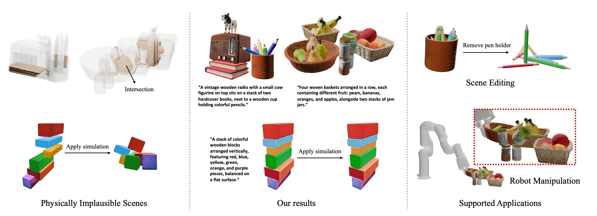

<h1 align="center">PAT3D: Physics-Augmented Text-to-3D Scene Generation</h1> 
<div align="center"> <p> <strong>Guying Lin</strong><sup>1</sup>, <strong>Kemeng Huang</strong><sup>2,1</sup>, <strong>Michael Liu</strong><sup>1</sup>, <strong>Ruihan Gao</strong><sup>1</sup>, <strong>Hanke Chen</strong><sup>1</sup>, <strong>Lyuhao Chen</strong><sup>1</sup>,


<strong>Beijia Lu</strong><sup>1</sup>, <strong>Taku Komura</strong><sup>2</sup>, <strong>Yuan Liu</strong><sup>3</sup>, <strong>Jun-Yan Zhu</strong><sup>1</sup>, <strong>Minchen Li</strong><sup>1,4</sup> </p> <p> <sup>1</sup>Carnegie Mellon University &nbsp;&nbsp; <sup>2</sup>The University of Hong Kong


<sup>3</sup>The Hong Kong University of Science and Technology &nbsp;&nbsp; <sup>4</sup>Genesis AI </p> <p> <strong>International Conference on Learning Representations (ICLR), 2026</strong> </p>

<a href="https://arxiv.org/pdf/2511.21978"></a>
<a href="https://github.com/Simulation-Intelligence/PAT3D"></a>
<a href="https://simulation-intelligence.github.io/PAT3D/"></a>


<div align="center">
  
</div>
</div>


## Generation  

- Code: https://github.com/Simulation-Intelligence/PAT3D
- Website: https://simulation-intelligence.github.io/PAT3D/


## Citation


```bibtex
@inproceedings{
      lin2026patd,
      title={{PAT}3D: Physics-Augmented Text-to-3D Scene Generation},
      author={Guying Lin and Kemeng Huang and Michael Liu and Ruihan Gao and Hanke Chen and Lyuhao Chen and Beijia Lu and Taku Komura and Yuan Liu and Jun-Yan Zhu and Minchen Li},
      booktitle={The Fourteenth International Conference on Learning Representations},
      year={2026},
      url={https://openreview.net/forum?id=iIRxFkeCuY}
      }
```


## Acknowledgement

The simulation part of this project is developed based on the open-source project [libuipc](https://github.com/spiriMirror/libuipc). We sincerely thank all the authors of that project!


