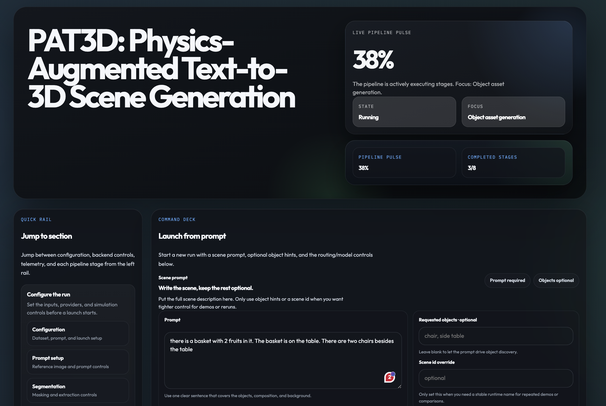

<h1 align="center">PAT3D: Physics-Augmented Text-to-3D Scene Generation</h1>

<div align="center">
  <p>
    <strong>Guying Lin</strong><sup>1</sup>,
    <strong>Kemeng Huang</strong><sup>2,1</sup>,
    <strong>Michael Liu</strong><sup>1</sup>,
    <strong>Ruihan Gao</strong><sup>1</sup>,
    <strong>Hanke Chen</strong><sup>1</sup>,
    <strong>Lyuhao Chen</strong><sup>1</sup>,
    <strong>Beijia Lu</strong><sup>1</sup>,
    <strong>Taku Komura</strong><sup>2</sup>,
    <strong>Yuan Liu</strong><sup>3</sup>,
    <strong>Jun-Yan Zhu</strong><sup>1</sup>,
    <strong>Minchen Li</strong><sup>1,4</sup>
  </p>
  <p>
    <sup>1</sup>Carnegie Mellon University &nbsp;&nbsp;
    <sup>2</sup>The University of Hong Kong &nbsp;&nbsp;
    <sup>3</sup>The Hong Kong University of Science and Technology &nbsp;&nbsp;
    <sup>4</sup>Genesis AI
  </p>
  <p><strong>International Conference on Learning Representations (ICLR), 2026</strong></p>
  <p>
    <a href="https://simulation-intelligence.github.io/PAT3D/"></a>
    <a href="https://openreview.net/pdf?id=iIRxFkeCuY"></a>
    <a href="https://huggingface.co/datasets/guyingl/pat3d/tree/main/experiments"></a>
    <a href="https://github.com/Simulation-Intelligence/PAT3D"></a>
  </p>
</div>

<div align="center">
  
</div>

## Overview

PAT3D generates physically grounded simulation-ready 3D scenes from text prompts. The release code is organized around the dashboard pipeline: a web UI launches a staged Python worker, the worker calls provider modules for each stage, and outputs are written as structured runtime JSON plus mesh, rendered image, and metric.

### Dashboard Website Overview

The dashboard website provides one place to configure a text-to-3D scene run, launch the staged pipeline, monitor live progress, inspect intermediate artifacts, view the final scene, and compute metrics.

<div align="center">
  
</div>

## Pipeline

The dashboard runs the paper-core pipeline stage by stage:

1. Reference image generation: create the anchor image from the scene prompt.
2. Scene understanding: estimate depth and segment requested objects.
3. Object relation extraction: describe objects, infer support/containment relations, and estimate size priors.
4. Object asset generation: create or load per-object 3D assets.
5. Layout initialization: place objects into an initial semantic scene layout.
6. Simulation preparation: convert layout assets into low-poly simulation-ready meshes.
7. Physics simulation: run forward simulation or diff-sim initialization plus forward simulation.
8. Visualization: export scene bundles and rendered previews for the dashboard viewer.
9. Metrics: render metric views and compute semantic scores for generated scenes.

## Backend Routing

Most dashboard stages use a single release backend. The useful routing summary is:

| Module | Backbone / upstream |
| --- | --- |
| Reference image | OpenAI image model, `gpt-image-1.5` |
| Object/relation text reasoning | OpenAI structured LLM, `gpt-5.4` |
| Depth | DepthPro through [`apple/ml-depth-pro`](https://github.com/apple/ml-depth-pro) |
| Segmentation | SAM 3 text segmentation through [`facebookresearch/sam3`](https://github.com/facebookresearch/sam3) |
| Object assets | Hunyuan3D 2 through [`Tencent-Hunyuan/Hunyuan3D-2`](https://github.com/Tencent-Hunyuan/Hunyuan3D-2) |
| Simulation mesh prep | fTetWild through [`wildmeshing/fTetWild`](https://github.com/wildmeshing/fTetWild) |
| Semantic metrics | CLIPScore with `openai/clip-vit-base-patch16`; VQAScore with `clip-flant5-xl` through [`linzhiqiu/t2v_metrics`](https://github.com/linzhiqiu/t2v_metrics); GPT-based physical-plausibility score through OpenAI vision model |

## Requirements

PAT3D is maintained around two supported install paths:

| Path | Host requirements | Notes |
| --- | --- | --- |
| Native install | Ubuntu 24.04 x86_64, Python 3.10, NVIDIA GPU, CUDA 13, local Linux filesystem | Best choice when you want repo-local virtual environments and direct host execution. The bundled private physics wheel targets this ABI. |
| Docker install | Linux host with Docker Engine, NVIDIA Container Toolkit, and a working `docker run --gpus all ...` path | PAT3D runs inside the bundled CUDA 13 / Ubuntu 24.04 image |

Install these host tools before setting up PAT3D:

- Git
- Node.js 20 or newer and npm
- NVIDIA driver with CUDA 13 support
- Docker Engine plus NVIDIA Container Toolkit if you are using the Docker path
- [Blender](https://www.blender.org/download/) 4.x for rendered previews and scene export

Additional components used by the full PAT3D workflow:

| Component | Required for | Expected setup |
| --- | --- | --- |
| [`apple/ml-depth-pro`](https://github.com/apple/ml-depth-pro) | Depth estimation | Installed by `pat3d.yml` as `depth-pro @ git+https://github.com/apple/ml-depth-pro.git` |
| [`extern/Hunyuan3Dv2`](https://github.com/Tencent-Hunyuan/Hunyuan3D-2) | Textured object asset generation | Local checkout under `extern/Hunyuan3Dv2`, plus Hugging Face model access/cache for `Tencent-Hunyuan/HunyuanDiT-v1.2-Diffusers-Distilled`, `tencent/Hunyuan3D-2mini`, and `tencent/Hunyuan3D-2` |
| [`extern/fTetWild`](https://github.com/wildmeshing/fTetWild) | Low-poly and tet-ready simulation mesh prep | Build `FloatTetwild_bin` under `extern/fTetWild/build`, or set `PAT3D_FTETWILD_BIN` / `FTETWILD_BIN` |
| [`extern/sam3`](https://github.com/facebookresearch/sam3) | SAM 3 text-prompt segmentation | Local checkout plus Hugging Face access to `facebook/sam3` and `facebook/sam3.1`; set `PAT3D_SAM3_PYTHON` |
| [`extern/t2v_metrics`](https://github.com/linzhiqiu/t2v_metrics) | VQAScore metrics only | Local checkout plus a compatible VQAScore Python; set `PAT3D_T2V_METRICS_ROOT` and `PAT3D_VQA_PYTHON` |
| Prebuilt Diff_GIPC / libuipc wheel | Differentiable physics backend | Required for PAT3D. This repo ships a prebuilt `pyuipc` wheel with Diff_GIPC support under `private_wheels/`, and the setup scripts use it by default. |

DepthPro expects the pretrained checkpoint at `extern/ml-depth-pro/checkpoints/depth_pro.pt` by default. You can override it with `PAT3D_DEPTH_PRO_CHECKPOINT` if the checkpoint lives elsewhere.

The bundled `pyuipc-0.9.0-cp310-cp310-linux_x86_64.whl` is built for the supported Ubuntu 24.04 target. On older glibc targets such as Ubuntu 22.04, the native launch path may fail to load the private physics backend. In that case, use the Docker path or provide a compatible replacement wheel through `PAT3D_PRIVATE_PHYSICS_WHEEL`.

## Installation

Run all commands from the repository root.

The canonical installers are `scripts/setup_install.py` for native installs and `scripts/setup_docker_install.sh` for Docker installs. Both produce `.env.install`, which is consumed by the launch scripts.

### 1. Clone the repository

```bash
git clone https://github.com/Simulation-Intelligence/PAT3D
cd PAT3D
```

If your release uses Git submodules, initialize them:

```bash
git submodule update --init --recursive
```

If the external repositories are distributed separately, place them under `extern/` with these expected paths:

| Path | Upstream repository |
| --- | --- |
| `extern/Hunyuan3Dv2` | [`Tencent-Hunyuan/Hunyuan3D-2`](https://github.com/Tencent-Hunyuan/Hunyuan3D-2) |
| `extern/fTetWild` | [`wildmeshing/fTetWild`](https://github.com/wildmeshing/fTetWild) |
| `extern/sam3` | [`facebookresearch/sam3`](https://github.com/facebookresearch/sam3) |
| `extern/t2v_metrics` | [`linzhiqiu/t2v_metrics`](https://github.com/linzhiqiu/t2v_metrics) |

Install these external repositories before running the full dashboard workflow. `extern/t2v_metrics` is only required when you want VQAScore metrics.

### 2. Configure credentials and local paths

Create `.env`:

```bash
cp .env.example .env
```

Set these values before running either installer:

```bash
HF_TOKEN=<token with access to facebook/sam3 and facebook/sam3.1>
```

PAT3D includes a prebuilt Diff_GIPC / libuipc wheel at `private_wheels/pyuipc-0.9.0-cp310-cp310-linux_x86_64.whl`, and both setup scripts use that tracked wheel automatically.

You also need an OpenAI key before launching the dashboard:

```bash
OPENAI_API_KEY=<your_key>
```

Common optional overrides:

```bash
OPENAI_BASE_URL=https://api.openai.com/v1
OPENAI_MODEL=gpt-5.4
OPENAI_IMAGE_MODEL=gpt-image-1.5
BLENDER_BIN=/path/to/blender
PAT3D_HF_TOKEN_FILE=/absolute/path/to/hf_token.txt
PAT3D_PRIVATE_PHYSICS_WHEEL=/absolute/path/to/alternate/pyuipc-0.9.0-cp310-cp310-linux_x86_64.whl
```

### 3. Choose an install path

#### Native install

Use this when the host already matches the supported Linux/NVIDIA target:

```bash
python3 scripts/setup_install.py
```

The native installer provisions:

- `.venv` for the main PAT3D runtime
- `.venv-sam3` for SAM 3
- `extern/Hunyuan3Dv2` if the checkout is missing
- `extern/fTetWild` if the checkout is missing
- `extern/sam3`
- `checkpoints/depth_pro.pt`
- `checkpoints/sam3/config.json` and `checkpoints/sam3/sam3.pt`
- `extern/fTetWild/build-local/FloatTetwild_bin`
- Hunyuan native extensions (`custom_rasterizer`, `custom_rasterizer_kernel`, and `mesh_processor`)
- dashboard npm dependencies and a Playwright browser
- `.env.install` with the derived PAT3D path variables

Launch the dashboard:

```bash
bash scripts/run_dashboard.sh
```

#### Docker install

Use this when you want the supported PAT3D runtime to live inside the bundled container image:

```bash
bash scripts/setup_docker_install.sh
```

Then launch the dashboard from the installed Docker environment:

```bash
bash scripts/run_docker_dashboard.sh
```

The Docker path:

- build `docker/Dockerfile.install` if needed
- run the installer inside the supported CUDA 13 / Ubuntu 24.04 image with `--gpus all`
- mount the repo, the private physics wheel, and persistent local caches
- run `scripts/setup_install.py --skip-system-deps` inside the container
- reuse the installed repo-local `.venv`, `.venv-sam3`, checkpoints, and caches when serving the dashboard

If you only want to build the reusable image first:

```bash
bash scripts/build_docker_image.sh
```

### 4. Optional integrations

- Install [Blender](https://www.blender.org/download/) 4.x for rendered scene previews and exports.
- For VQAScore metrics, add [`extern/t2v_metrics`](https://github.com/linzhiqiu/t2v_metrics) and set:

```bash
PAT3D_T2V_METRICS_ROOT=/absolute/path/to/extern/t2v_metrics
PAT3D_VQA_PYTHON=/absolute/path/to/vqa/python
PAT3D_T2V_HF_CACHE_DIR=/absolute/path/to/data/metrics/hf_cache
```

- The generated `.env.install` file already records `PAT3D_DASHBOARD_PYTHON`, `PAT3D_SAM3_PYTHON`, `PAT3D_SAM3_CHECKPOINT_PATH`, and `PAT3D_FTETWILD_BIN`. You usually do not need to set them manually.
- The dashboard writes generated scene data under `results/workspaces/<scene_id>/...`, with runtime metadata, job state, and metrics under `results/runtime/`, `results/dashboard_jobs/`, and `results/metrics/`.

## Run the Dashboard

If you used the native install:

```bash
bash scripts/run_dashboard.sh
```

If you used the Docker install:

```bash
bash scripts/run_docker_dashboard.sh
```

For manual development wiring only, you can also start the dashboard server with:

```bash
npm --prefix dashboard run dev
```

Open:

```text
http://127.0.0.1:4173
```

Typical dashboard flow:

1. Enter a scene prompt, for example `A small wooden chair next to a round side table in a simple room.`
2. Optionally enter a scene name, for example `demo_chair_table`.
3. Review the requested objects and choose `automatic` or `manual` segmentation.
4. Configure physics settings. By default, diff-sim is off and the pipeline uses forward simulation settings.
5. Click `Generate`.
6. Watch the stage progress panel and open the log panel if a stage fails.
7. Inspect the final scene in the browser viewer.
8. Run metrics for the selected output when you need semantic evaluation.

## Metrics

### Semantic Metrics

| Metric | Description |
|---|---|
| **CLIPScore** | Measures overall image–text alignment between the rendered views and the scene prompt. |
| **VQAScore** | Measures how well the rendered views visually answer the scene prompt, using a stronger vision–language evaluator. |
| **GPT Visual Physical-Plausibility Score** | Measures whether the rendered scene looks physically plausible, including support, contact, gravity consistency, stability, and the absence of obvious interpenetration or floating objects. |

### Physical Metrics

| Metric | Description |
|---|---|
| **Ratio of Penetrating Triangle Pairs** | Quantifies the extent of penetration between objects in the scene and serves as an indicator of geometric correctness. |
| **Simulated Scene Displacement** | Computes the normalized average displacement of object vertices before and after simulation. This metric is not directly provided in the release because it requires a special Ubuntu environment that is not the default runtime. Source code is available upon request. |


## Citation


```bibtex
@inproceedings{
      lin2026patd,
      title={{PAT}3D: Physics-Augmented Text-to-3D Scene Generation},
      author={Guying Lin and Kemeng Huang and Michael Liu and Ruihan Gao and Hanke Chen and Lyuhao Chen and Beijia Lu and Taku Komura and Yuan Liu and Jun-Yan Zhu and Minchen Li},
      booktitle={The Fourteenth International Conference on Learning Representations},
      year={2026},
      url={https://openreview.net/forum?id=iIRxFkeCuY}
      }
```

## Acknowledgement

The simulation part of this project is developed based on the open-source project [libuipc](https://github.com/spiriMirror/libuipc). We sincerely thank all the authors of that project.
